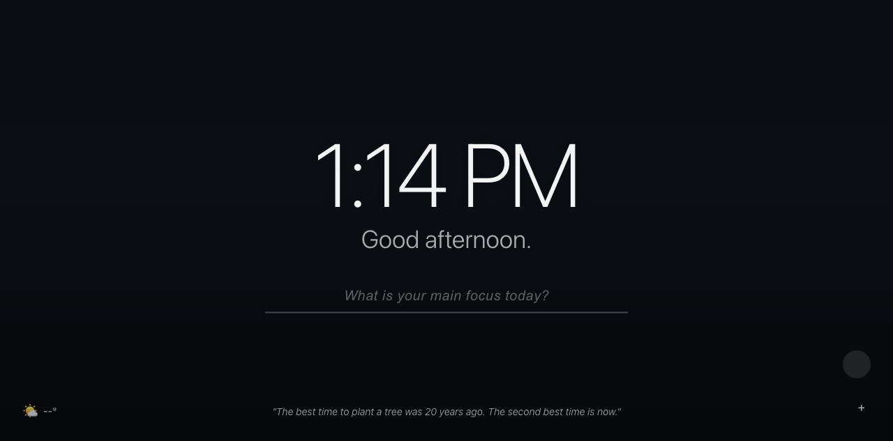

# Horizon

> A beautiful, AI-powered new tab page. Cross-browser. Hermes-ready.

Horizon replaces your new tab with a calm, focused landing page. It shows the time, your daily focus, weather, an inspirational quote, and a stunning full-screen background. And if you run [Hermes](https://github.com/NousResearch/hermes-agent), it connects directly to give you ambient intelligence — daily briefings, knowledge retrieval, and context-aware suggestions — all from a single new tab.



## Features

### Core (standalone — works without anything else)

- **Full-screen daily background** — Beautiful high-res photos from Unsplash. Changes daily. Choose from Nature, Minimal, Architecture, or Travel collections.
- **Clock** — Large, centered, 12h or 24h with optional seconds. Your timezone.
- **Greeting** — "Good morning, Satish." Adapts to time of day. Customisable name.
- **Daily focus** — One big focus field. Type what matters today and it stays visible. Check it off when you're done. Carries forward until you change it.
- **Weather** — Current temp, conditions, and city. Uses browser geolocation. No API key needed (Open-Meteo).
- **Inspirational quote** — Changes hourly. Fresh perspective each time you open a tab.
- **To-do list** — Quick checklist. Add, complete, delete. Persists across sessions.
- **Quick links** — Pinned shortcuts with favicons. GitHub, Gmail, and YouTube by default. Add your own.
- **Settings panel** — Name, clock format, temperature unit, photo category.

### Hermes Integration (opt-in)

When you enable Hermes in settings, Horizon connects to your local Hermes agent:

- **Daily briefing** — Hermes generates a morning brief with your calendar, suggested focus, and weather context. Appears automatically.
- **Command bar** — Press `Cmd+K` (or just start typing) to ask Hermes anything. "Find the JLM contract", "What's my first meeting?", "Draft email to Lauren" — results appear inline.
- **Shared memory** — Your focus and to-dos sync to Hermes memory. Accessible from any Hermes surface (chat, gateway, other apps).
- **Focus continuity** — Hermes remembers what you were working on yesterday and suggests carrying it forward.

### Privacy

All Hermes communication happens over `localhost`. No data leaves your machine. No accounts, no tracking, no analytics. The Unsplash, weather, and quote APIs are called directly from your browser.

## Installation

### Chrome

1. Clone this repo
2. Go to `chrome://extensions`
3. Enable "Developer mode"
4. Click "Load unpacked" and select the `horizon` folder
5. Open a new tab

### Firefox

1. Clone this repo
2. Go to `about:debugging#/runtime/this-firefox`
3. Click "Load Temporary Add-on"
4. Select `manifest.json` from the `horizon` folder
5. Open a new tab

Or build for permanent install:

```bash
npm install
npm run build:firefox
# Load dist/firefox as an unsigned extension, or submit dist/horizon-firefox.zip to AMO
```

### From the Chrome Web Store / Firefox Add-ons

*Coming soon.*

## Hermes Integration Setup

1. Make sure [Hermes](https://github.com/NousResearch/hermes-agent) is installed and running
2. Enable the API server in Hermes:
   ```bash
   hermes gateway setup
   # Enable the "API Server" adapter
   ```
3. Open Horizon settings (gear icon, bottom-right)
4. Toggle "Hermes integration" on
5. Default URL is `http://localhost:8942` — change if your Hermes API server is on a different port

## Development

```bash
# Install dev dependencies
npm install

# Lint the extension
npm run lint

# Run in Chrome (temporary profile)
npm run dev:chrome

# Run in Firefox (temporary profile)
npm run dev:firefox

# Build for both browsers
npm run build
```

## Project Structure

```
horizon/
├── manifest.json          # Cross-browser Manifest V3
├── background.js           # Service worker (alarms, API bridging)
├── package.json            # Build scripts + web-ext
├── newtab/
│   ├── index.html          # New tab page
│   ├── style.css           # All styles
│   ├── app.js              # Main application logic
│   └── hermes.js           # Hermes integration module
├── icons/                  # Extension icons (SVG + PNG)
└── scripts/
    └── build.sh            # Build for Chrome + Firefox
```

## Tech Stack

- **Manifest V3** — Works on Chrome 88+ and Firefox 109+
- **Vanilla JS** — No frameworks, no build step. Just HTML, CSS, and JS.
- **Open-Meteo** — Free weather API, no key required
- **Unsplash** — Free high-res photos via source API
- **Quotable** — Free quotes API
- **Hermes** — Local AI agent for ambient intelligence

## Why "Horizon"?

It's what you see when you open a new tab before diving into the noise. A clean line between where you are and where you're going. And it's where your day starts.

## License

MIT — see [LICENSE](LICENSE)

---

Built by [Satish Kumar](https://github.com/thesatishk). AI integration powered by [Hermes](https://github.com/NousResearch/hermes-agent).